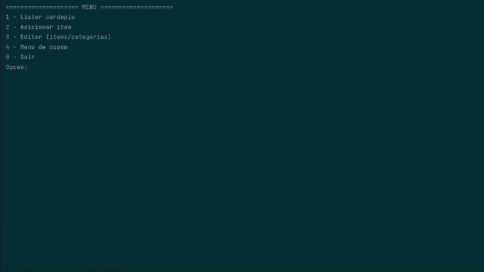
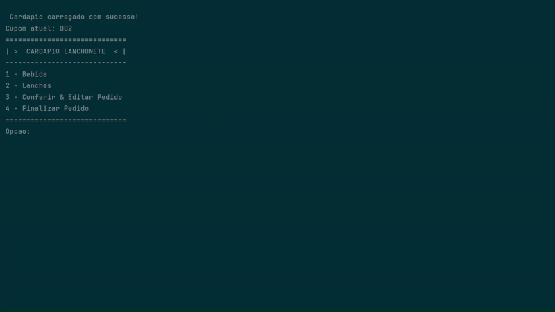
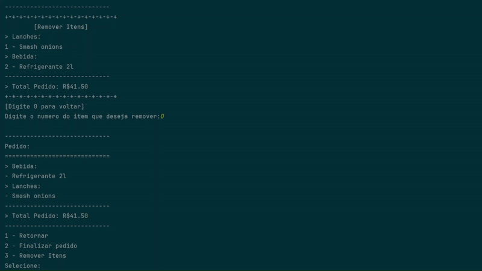
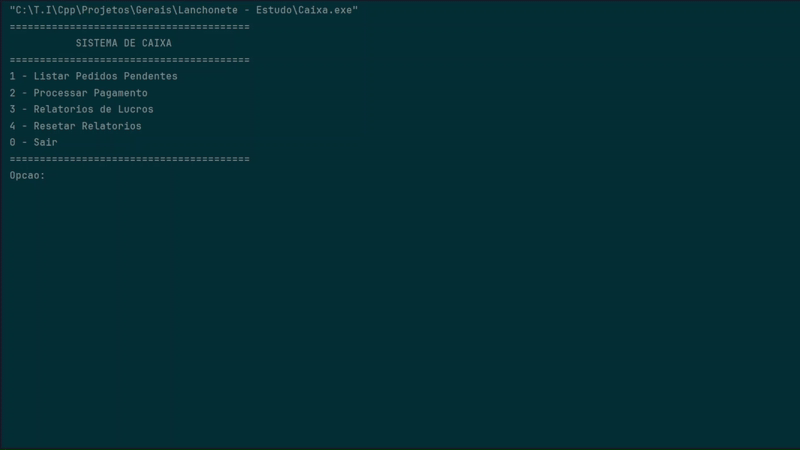
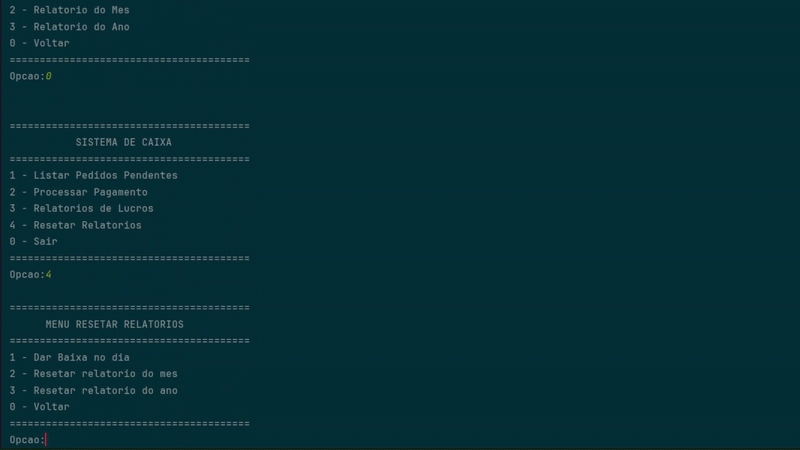

# 🎲 Restaurant System

## 📦 Requirements
- **C++17 or higher**
- No external libraries required  
(Only a standard C++ compiler such as g++, clang, or MSVC)

------------------------------------------------------------

## 🚀 How to Run
Compile each module and run according to its role:

g++ Lanchonete.cpp -o Lanchonete
g++ Cliente.cpp -o Cliente
g++ Caixa.cpp -o Caixa

------------------------------------------------------------

## 🧩 How It Works

The system is divided into three connected modules:

1. Lanchonete (Restaurant) – creates and manages the menu  
2. Cliente (Client) – browses the menu and places orders  
3. Caixa (Cashier) – processes payments and tracks profits  

These modules share .csv and .txt files to keep data synchronized.

------------------------------------------------------------

## 🏪 Lanchonete (Restaurant)

Used by the restaurant owner or manager to set up and maintain the menu.

Main features:
- Add, edit, and remove items and categories
- Reorder products as needed
- Define and modify the current coupon number
- Reset coupon numbering when starting a new sales cycle

- 

  
  

------------------------------------------------------------

## 👤 Cliente (Client)

Used by the customer to browse the menu and create an order.

Main features:
- View the complete menu
- Select items by category
- Review, edit, or remove products from the order
- See the total price before confirming
- Enter their name and generate a coupon
- Send the order to the Cashier for payment

- 

  
  

------------------------------------------------------------

## 💰 Caixa (Cashier)

Used by the cashier to manage open orders and handle payments.

Main features:
- List pending orders
- View order details
- Confirm and record payments
- Generate profit reports:
  - Daily
  - Monthly
  - Yearly
- Reset reports when closing a period

- 

  
  

------------------------------------------------------------

## 🗂 Files Used

The system stores data in simple CSV/TXT files for communication between modules:

- menu.csv – menu created by the restaurant  
- pedidos_abertos.csv – pending orders  
- pedidos_pagos.csv – completed orders  
- lucros_mes.csv / lucros_ano.csv – monthly and yearly profits  
- settings.txt – current coupon tracking  

------------------------------------------------------------

## 🧾 Simplified Workflow

[Lanchonete] → Creates menu  
      ↓  
[Cliente] → Places order and generates coupon  
      ↓  
[Caixa] → Processes payment and records profit
